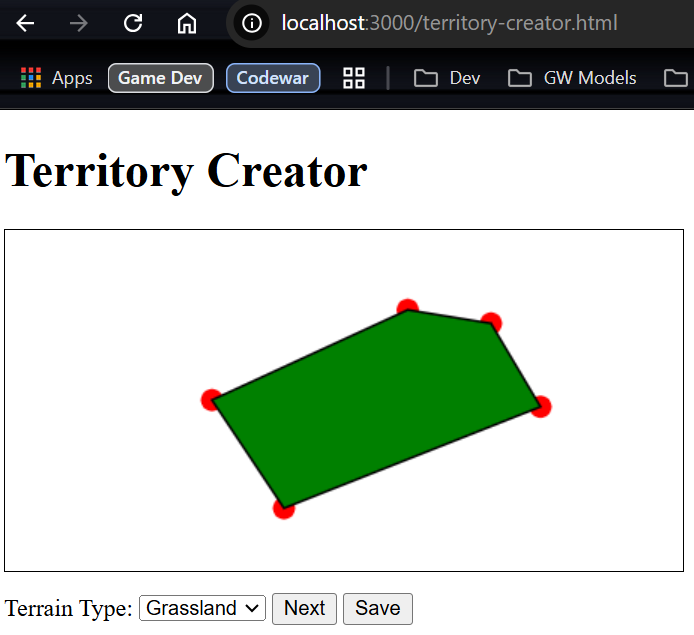

# Territory Creator

A vector-based territory designer for creating and saving custom maps with various terrain types. Built with **Node.js**, **Express**, **MongoDB**, and **Paper.js**.


---

## Features

- **Vector-Based Design**: Draw territories by clicking on the canvas to create polygons.
- **Terrain Types**: Choose from multiple terrain types (e.g., Urban, Grassland, Desert, Mountain, Forest, Swamp, Tundra).
- **Save Maps**: Save your map to a MongoDB database for later retrieval.
- **Interactive UI**: Use "Next" and "Prev" buttons to navigate between territories.

---

## Prerequisites

Before running the project, ensure you have the following installed:

- [Node.js](https://nodejs.org/) (v14 or higher)
- [MongoDB](https://www.mongodb.com/) (running locally on `mongodb://localhost:27017`)

---

## Installation

1. **Clone the repository**:
   ```bash
   git clone https://github.com/Ayelis/territory-creator.git
   cd territory-creator
   ```

2. **Install dependencies**:
   ```bash
   npm install
   ```

3. **Start MongoDB**:
   Ensure MongoDB is running locally on the default port (`27017`).

4. **Run the server**:
   ```bash
   node server.js
   ```

5. **Open the application**:
   Navigate to `http://localhost:3000/territory-creator.html` in your browser.

---

## Usage

1. **Draw Territories**:
   - Click on the canvas to add points and create a polygon.
   - Use the "Terrain Type" dropdown to select the terrain for the current territory.

2. **Navigate Territories**:
   - Click **Next** to save the current territory and start a new one.
   - Click **Prev** to go back to the previous territory.

3. **Save the Map**:
   - Click **Save** to save all territories to the database.

---

## File Structure

```
territory-creator/
├── server.js               # Backend server (Node.js + Express + MongoDB)
├── package.json            # Node.js dependencies and scripts
├── territory-creator.html  # Frontend HTML file
├── territory-creator.js    # Frontend logic (Paper.js)
└── public/                 # Static files (if any)
```

---

## API Endpoints

- **POST `/api/maps`**: Save a map to the database.
  - Request Body: Array of territories (each with `id`, `owner`, `terrainType`, and `coordinates`).
  - Response: Success or error message.

---

## Known Issues

1. **Missing Save information/metadata**:
   - The Save feature doesn't save any extra data about the map.

2. **Missing Load button/screen**:
   - There's no Load button or functionality.

---

## Future Improvements

1. **Territory Editing**:
   - Allow users to edit existing territories (e.g., move points).

2. **Map Loading**:
   - Add functionality to load and edit saved maps from the database.

3. **Enhanced UI**:
   - Add a sidebar to display all territories in the current map.
   - Include a "Delete Territory" button.

4. **Export Maps**:
   - Add functionality to export maps as JSON or vector image files.

5. **Import Maps**:
   - Add functionality to import maps from JSON or vector image files.

---

## Contributing

Contributions are welcome! If you'd like to contribute, please follow these steps:

1. Fork the repository.
2. Create a new branch for your feature or bug fix.
3. Submit a pull request with a detailed description of your changes.

---

## License

This project is licensed under the **ISC License**. See the [LICENSE](LICENSE.md) file for details.

---

## Acknowledgments

- [Paper.js](http://paperjs.org/) for the vector graphics library.
- [Express](https://expressjs.com/) for the backend framework.
- [MongoDB](https://www.mongodb.com/) for the database.
